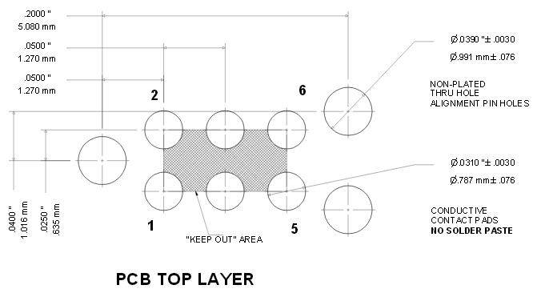
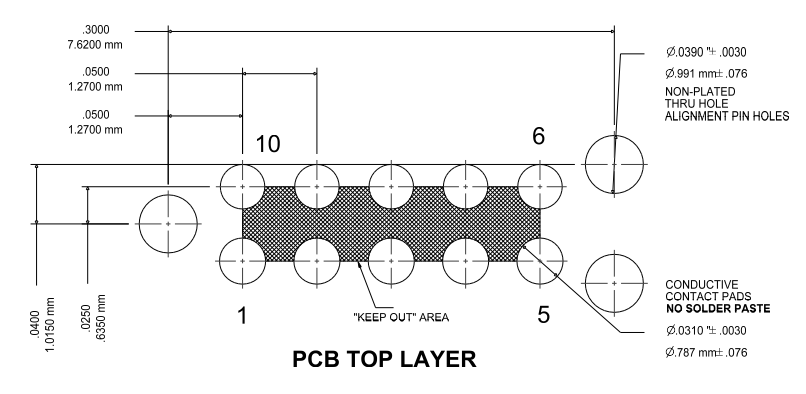

# Jlink adapter

## Table of contents

​	[1. Short User's Guide](#1. Short User's Guide)

​		[1.1 Target PCB connector](#1.1 Target PCB connector)

​		[1.2 Serial Tx/Rx](#1.2 Serial Tx/Rx)

​		[1.3 Power supply](#1.3 Power supply)

​	[2. Layout guidelines](#2. Layout guidelines)

​		[2.1 Tag-Connect footprint](#2.1 Tag-Connect footprint)

​		[2.2 Component to add](#2.2 Component to add)

​	[3 - Advanced information](#3---advanced-information)

## 1. Short User's Guide

This adapter is designed for be plugged in any [J-Link debugger](https://www.segger.com/products/debug-probes/j-link/models/model-overview/) except the EDU mini. It allows the use of SWD interface with additional functionality including:

* Power supply to the target board
* I2C output signals
* UART output signals (usable as [J-Link's VCOM](https://wiki.segger.com/J-Link_Virtual_COM_Port))

It is recommended to use this adapter with Tag-Connect connectors, although it is technically possible to use a standard programming cable.

### 1.1 Target PCB connector

Two connectors are possible on the target PCB side, either a standard TST-105 (.100"/2.54 mm pitch) or a FTSH-105 (.050"/1.27 mm pitch) , both with 2x5 pins.

The Tag-Connect connectors recommended are the following:

* **[TC2030-CTX-NL](https://www.tag-connect.com/product/tc2030-ctx-nl-6-pin-no-legs-cable-with-10-pin-micro-connector-for-cortex-processors)** - 6 pins, 0.05", "No legs"
* **[TC2050-IDC-NL](https://www.tag-connect.com/product/tc2050-idc-nl-10-pin-no-legs-cable-with-ribbon-connector)** - 10 pins, 0.1", "No legs"
* **[TC2050-IDC-NL-050-ALL](https://www.tag-connect.com/product/tc2050-idc-nl-050-all)** - 10 pins, 0.05", "No legs"

"No legs" versions recommended as they are more compact.

>:warning: **TC2050-IDC-NL** (without the *-ALL*) is not recommended, pins 5 and 9 are **not connected**.

> :warning: **TC2030-ALT-NL** is the only version of the cable with 6 pins and 2x5, 2.54 pitch but the connection are **not suitable** for use with this adapter.

#### Selection of the connector

Depending if a 6 pins or 10 pins is chosen, the pinout association will be different. The selection of the used cable is done with pins 1-4 of the DIP switch *S1*:

|      | TC2030 | TC2050 |
| ---- | ------ | ------ |
| 1    | ON ✅   | OFF ❌  |
| 2    | OFF ❌  | ON ✅   |
| 3    | OFF ❌  | ON ✅   |
| 4    | OFF ❌  | ON ✅   |

### 1.2 Serial Tx/Rx

Two serial pins can be used either as UART or as [J-Link's VCOM](https://wiki.segger.com/J-Link_Virtual_COM_Port) signals. In both case Tx and Rx signals are connected to header pin 3 and 4, but connection to J-Link can be interrupted with pin 5 and 6 of the DIP switch *S1*.

 ### 1.3 Power supply

The J-Link can supply 5V over pin 19 of the JTAG connector. The command `power on` must be typed in [J-Link Commander](https://wiki.segger.com/J-Link_Commander) (JLink.exe/JLinkExe) to enable it (`power on perm` set it as default value).

The switch *S2* has 3 positions:

* **5V** - target board is directly powered by the J-Link, header `Vin` is also connected to this voltage (5V/220mA).
* **ext.** - `Vin` pin of the Tag-Connect connector is only connected to the header `Vin`, useful to power the target with an external power supply.
* **3.3V** - target board is powered by the J-Link's 5V through a adaptable LDO regulator. Output is fixed to 3.3V but can be adjusted in the range 0.8V-3.6V by means of changing a single resistor (for further information: [J-Link Target Supply Adapter](https://www.segger.com/products/debug-probes/j-link/accessories/adapters/target-supply-adapter/)).

Jumper *P1* can be used to monitor the current consumption of the target board.

Power supply is connected to pin `Vin`. The choice not to use the `Vtef` pin is motivated by the fact that on some circuits the supply voltage is not necessarily the same as the signal reference voltage.

## 2. Layout guidelines

### 2.1 Tag-Connect footprint

The pin numbering of the TC2030, respectively the TC2050 connectors doesn't follow the same logic.

**TC2030** pin numbering:

| Pin  | Function |
| ---- | -------- |
| 1    | VTref    |
| 2    | SWDIO    |
| 3    | Reset    |
| 4    | SWCLK    |
| 5    | GND      |
| 6    | Vin      |

**TC2050** pin numbering:

| Pin  | Function |
| ---- | -------- |
| 1    | VTref    |
| 2    | SWDIO    |
| 3    | GND      |
| 4    | SWCLK    |
| 5    | Vin      |
| 6    | I2C SDA  |
| 7    | RxD      |
| 8    | I2C SCL  |
| 9    | TxD      |
| 10   | Reset    |

### 2.2 Component to add

It's advised to add the following on the target board for protection and stability.

* 100 kΩ pullup on `SWDIO`.
* 100 Ω inline current limiting resistors on `UART Tx` and `UART Rx` lines.
* 4.7 kΩ pullup resistor on I2C SDA/SCL (**mandatory**).

## 3 - Advanced information

* **TC2030:** his 4 unused pins are unfortunately not all "not connected". The cable follows the following connection logic:

  | TC2030 pins   | Pin connected on the 10-pins connector side |
  | ------------- | ------------------------------------------- |
  | 1             | 1                                           |
  | 2             | 2                                           |
  | 3             | 10                                          |
  | 4             | 4                                           |
  | 5             | 3, 5, 9                                     |
  | 6             | 6                                           |
  | Not Connected | 7, 8                                        |

* **TC2050** follows the logic connections 1-1, 2-2, 3-3, etc.

Due to the connection of the TC2030 cable, the folllowing pinout was chosen, in order to limit the number of modificaiton to do with use of each cable.

| 10 pins connector | TC2030                                                       | TC2050  |
| ----------------- | ------------------------------------------------------------ | ------- |
| 1                 | (1) VTref                                                    | VTref   |
| 2                 | (2) SWDIO                                                    | SWDIO   |
| 3                 | (5) GND *True connected GND*                            | GND     |
| 4                 | (4) SWCLK                                                    | SWCLK   |
| 5                 | (5) GND *Left floating in S1, connected to GND in TC2030* | Vin     |
| 6                 | (6) Vin                                                      | I2C SDA |
| 7                 | NC                                                           | Rx data |
| 8                 | NC                                                           | I2C SCL |
| 9                 | (5) GND *Left floating in S1, connected to GND in TC2030* | Tx data |
| 10                | (3) Reset                                                    | Reset   |